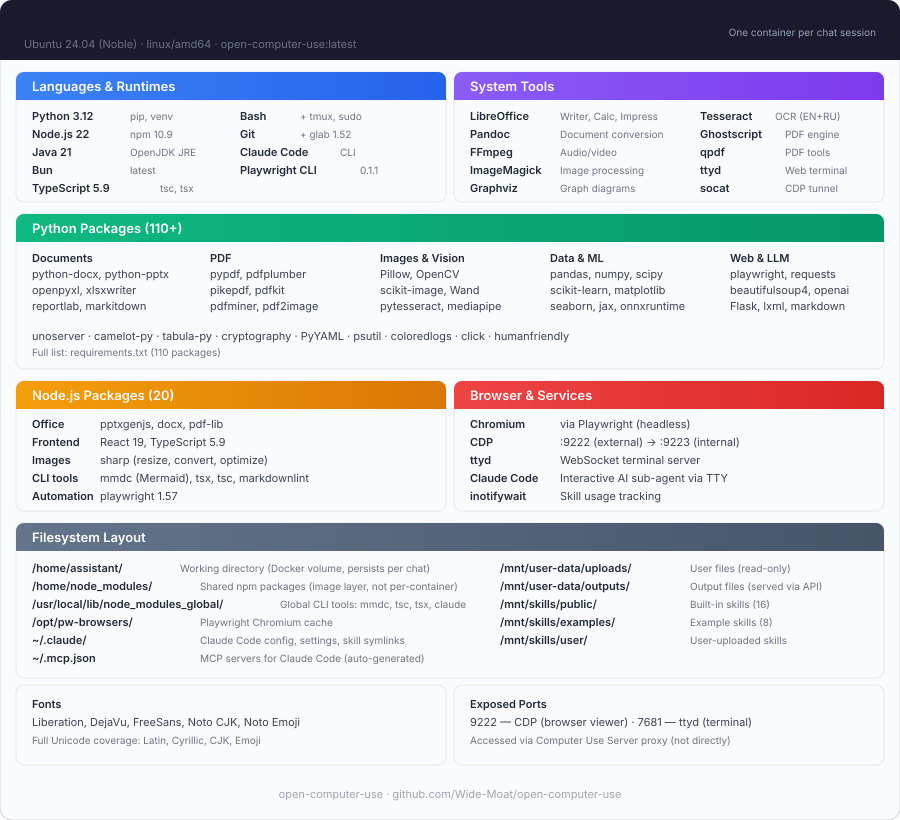

# Docker Architecture

Technical documentation for the AI Computer Use Docker environment.

## Architecture Overview



See also: [architecture.svg](architecture.svg) for the full system diagram.

**Volume Mounts:**
- `uploads` → `/mnt/user-data/uploads` (read-only)
- `outputs` → `/mnt/user-data/outputs` (read-write, served via HTTP)
- `skills` → `/mnt/skills` (read-only)
- `workspace` → `/home/assistant` (read-write, per-chat Docker volume)

## Dockerfile Structure

### Multi-Stage Build

The Dockerfile uses a multi-stage build approach for optimal layer caching:

1. **base**: Environment variables
2. **system-packages**: APT packages installation
3. **python-deps**: Python packages
4. **node-deps**: Node.js packages
5. **playwright-setup**: Playwright browsers
6. **final**: Directory structure and permissions

### Benefits
- Faster rebuilds (cached layers)
- Smaller final image (no build artifacts)
- Better organization

## Components

### Python Environment

**Version**: 3.12.3

**Key Packages** (107 total):
- Document: python-docx 1.2.0, python-pptx 1.0.2, openpyxl 3.1.5
- PDF: pypdf 5.9.0, pdfplumber 0.11.7, reportlab 4.4.10
- Image: Pillow 11.3.0, opencv-python 4.11.0
- Data: pandas 2.3.3, numpy 2.3.3
- Web: playwright 1.57.0, requests 2.32.5

### Node.js Environment

**Version**: 22.20.0

**Key Packages** (21 total):
- React 19.2.0 + react-dom
- TypeScript 5.9.3
- pdf-lib 1.17.1
- mermaid-cli 11.12.0
- marked 16.4.0

### System Packages

**Total**: 108 APT packages

**Categories**:
- Build tools: gcc 13, g++ 13, make
- Java: OpenJDK 21
- LibreOffice: writer, calc, impress
- Media: ffmpeg, imagemagick
- OCR: tesseract-ocr (EN, RU)
- Fonts: 20+ font packages

## Mount Points

### 1. User Data Uploads (Read-Only)

```
Host: ./data/uploads
Container: /mnt/user-data/uploads
Mode: ro (read-only)
```

**Purpose**: Input files for processing
**Usage**: Place files here from host, read from container

### 2. User Data Outputs (Read-Write)

```
Host: ./data/outputs
Container: /mnt/user-data/outputs
Mode: rw (read-write)
```

**Purpose**: Generated files and results
**Usage**: Write from container, read from host

### 3. Skills System (Read-Only)

```
Host: ./skills
Container: /mnt/skills
Mode: ro (read-only)
```

**Purpose**: Skills system files
**Structure**:
- /mnt/skills/public/ - Core skills
- /mnt/skills/examples/ - Example implementations

### 4. Workspace (Ephemeral)

```
Volume: ai-workspace
Container: /home/assistant
Mode: rw (read-write)
```

**Purpose**: Temporary working directory
**Lifecycle**: Data cleared when volume is removed
**Usage**: Temporary files, intermediate processing

## Resource Management

### CPU Limits

```yaml
limits:
  cpus: '4.0'        # Maximum 4 cores
reservations:
  cpus: '2.0'        # Reserved 2 cores
```

### Memory Limits

```yaml
limits:
  memory: 8G         # Maximum 8GB
reservations:
  memory: 4G         # Reserved 4GB
```

### Disk Usage

- **Base Image**: ~1GB (Ubuntu 24.04)
- **Python Packages**: ~5GB
- **Node Packages**: ~500MB
- **Playwright Browsers**: ~500MB (Chromium only)
- **System Packages**: ~3GB
- **Total**: ~15-20GB

## Networking

### Default Configuration

```yaml
network_mode: bridge
ports:
  - "8000:8000"      # HTTP server (optional)
```

### DNS Configuration

Default: Uses Docker bridge network DNS

Custom DNS (if needed):
```yaml
dns:
  - 8.8.8.8
  - 8.8.4.4
```

## Security

### Enabled Features

1. **no-new-privileges**: Prevents privilege escalation
2. **Read-only mounts**: Skills and uploads are read-only
3. **Network isolation**: Bridge network mode
4. **Resource limits**: CPU and memory constraints (configurable, see examples above)
5. **Standard Docker runtime (runc)**: Containers share the host kernel. For stronger isolation, consider [gVisor (runsc)](https://gvisor.dev/) which intercepts syscalls in userspace — this is what Claude.ai uses. gVisor support is on the roadmap. On Kubernetes, the [Helm chart](kubernetes.md) runs the sandboxes under rootless Podman by default, and can opt into hypervisor-grade isolation via [Kata Containers](kata-runtime.md).

### Optional Hardening

```yaml
# Read-only root filesystem
read_only: true
tmpfs:
  - /tmp:rw,noexec,nosuid
  - /home/assistant:rw,noexec,nosuid

# Drop all capabilities
cap_drop:
  - ALL
```

## Health Checks

### Docker Compose

```yaml
healthcheck:
  test: ["CMD", "python3", "-c", "import sys; sys.exit(0)"]
  interval: 30s
  timeout: 10s
  start_period: 10s
  retries: 3
```

### Manual Health Check

```bash
docker exec ai-computer-use python3 -c "import sys; sys.exit(0)"
echo $?  # Should output 0
```

## Environment Variables

### Python
- `PYTHONUNBUFFERED=1`: Unbuffered output
- `PIP_BREAK_SYSTEM_PACKAGES=1`: Allow system-wide pip installs
- `PYTHONDONTWRITEBYTECODE=1`: No .pyc files

### Node.js
- `NODE_PATH=/usr/local/lib/node_modules_global`
- `NODE_EXTRA_CA_CERTS=/etc/ssl/certs/ca-certificates.crt`

### Java
- `JAVA_HOME=/usr/lib/jvm/java-21-openjdk-amd64`

### Playwright
- `PLAYWRIGHT_BROWSERS_PATH=/opt/pw-browsers`

### SSL/TLS
- `REQUESTS_CA_BUNDLE=/etc/ssl/certs/ca-certificates.crt`
- `SSL_CERT_FILE=/etc/ssl/certs/ca-certificates.crt`

## Performance Optimization

### Build Optimization

1. **Layer Caching**: Install packages in order of change frequency
2. **Multi-stage**: Separate build stages for better caching
3. **Cleanup**: Remove package caches after installation

### Runtime Optimization

1. **Volume Mounts**: Fast I/O for data directories
2. **Resource Limits**: Prevent resource exhaustion
3. **Ephemeral Workspace**: Named volume for fast disk access

## Troubleshooting

### Check Container Status

```bash
docker-compose ps
docker stats ai-computer-use
```

### View Resource Usage

```bash
docker stats ai-computer-use --no-stream
```

### Inspect Container

```bash
docker inspect ai-computer-use
```

### Access Logs

```bash
docker-compose logs
docker-compose logs -f --tail=100
```

### Execute Commands

```bash
# One-off command
docker-compose exec ai-computer-use python3 --version

# Interactive shell
docker-compose exec ai-computer-use /bin/bash
```

## Maintenance

### Update Image

```bash
docker-compose build --no-cache
docker-compose up -d
```

### Clean Up

```bash
# Remove stopped containers
docker-compose down

# Remove volumes
docker-compose down -v

# Remove images
docker rmi ai-computer-use
```

### Backup Data

```bash
# Backup outputs
tar -czf outputs_backup.tar.gz data/outputs/

# Backup skills (if customized)
tar -czf skills_backup.tar.gz skills/
```

## Advanced Configuration

### Custom Base Image

Edit Dockerfile:
```dockerfile
FROM ubuntu:24.04  # Change to different base
```

### Additional Packages

Add to `apt-packages.txt`:
```
package-name
another-package
```

### Python Packages

Add to `requirements.txt`:
```
package-name==version
```

### Node Packages

Add to `package.json`:
```json
{
  "dependencies": {
    "package-name": "^version"
  }
}
```

## CI/CD Integration

### GitHub Actions Example

```yaml
name: Build Docker Image
on: [push]
jobs:
  build:
    runs-on: ubuntu-latest
    steps:
      - uses: actions/checkout@v3
      - name: Build image
        run: docker-compose build
      - name: Test image
        run: |
          docker-compose up -d
          docker-compose exec -T ai-computer-use python3 --version
```

## LiteLLM Integration (Optional)

When using Computer Use via LiteLLM proxy, headers are passed through the `extra_headers` mechanism.

### Supported Headers

| Parameter | Direct Header | OpenWebUI Format | Required |
|----------|------------------|------------------|--------------|
| Chat ID | `X-Chat-Id` | `X-OpenWebUI-Chat-Id` | Yes |
| User Email | `X-User-Email` | `X-OpenWebUI-User-Email` | No |
| User Name | `X-User-Name` | `X-OpenWebUI-User-Name` | No |
| GitLab Token | `X-Gitlab-Token` | `X-OpenWebUI-Gitlab-Token` | No |
| GitLab Host | `X-Gitlab-Host` | `X-OpenWebUI-Gitlab-Host` | No |
| Anthropic API Key | `X-Anthropic-Api-Key` | `X-OpenWebUI-Anthropic-Api-Key` | No |
| Anthropic Base URL | `X-Anthropic-Base-Url` | `X-OpenWebUI-Anthropic-Base-Url` | No |

### LiteLLM Configuration

Add MCP server to your LiteLLM `config.yaml`:

```yaml
mcp_servers:
  docker_ai:
    url: "http://localhost:8081/mcp"
    transport: "http"
    auth_type: "bearer_token"
    auth_value: "<MCP_API_KEY>"
    extra_headers:
      # OpenWebUI headers
      - "x-openwebui-chat-id"
      - "x-openwebui-user-email"
      - "x-openwebui-user-name"
      - "x-openwebui-gitlab-token"
      - "x-openwebui-gitlab-host"
      - "x-openwebui-anthropic-api-key"
      - "x-openwebui-anthropic-base-url"
      # Direct headers
      - "x-chat-id"
      - "x-user-email"
      - "x-user-name"
      - "x-gitlab-token"
      - "x-gitlab-host"
      - "x-anthropic-api-key"
      - "x-anthropic-base-url"
    allowed_tools:
      - "bash_tool"
      - "str_replace"
      - "create_file"
      - "view"
      - "sub_agent"
```

### How It Works

1. Client (OpenWebUI) adds `X-OpenWebUI-*` headers to requests
2. LiteLLM forwards them to MCP server (if specified in `extra_headers`)
3. `mcp_tools.py` reads headers via `set_context_from_headers()`
4. Priority: direct headers (`X-Chat-Id`) > OpenWebUI headers (`X-OpenWebUI-Chat-Id`)

### Example LiteLLM API Request

```bash
curl -X POST http://localhost:4000/v1/chat/completions \
  -H "Authorization: Bearer <API_KEY>" \
  -H "X-OpenWebUI-Chat-Id: my-chat-123" \
  -H "X-OpenWebUI-User-Email: user@example.com" \
  -H "Content-Type: application/json" \
  -d '{
    "model": "claude/claude-sonnet-4-5",
    "messages": [{"role": "user", "content": "Run ls -la"}],
    "tools": [{"type": "mcp", "server_label": "docker_ai"}]
  }'
```

### Direct MCP Server Access

```bash
# List tools
curl -s http://localhost:8081/mcp -X POST \
  -H "Authorization: Bearer <MCP_API_KEY>" \
  -H "Content-Type: application/json" \
  -d '{"jsonrpc":"2.0","id":1,"method":"tools/list"}'

# Execute command
curl -s http://localhost:8081/mcp -X POST \
  -H "Authorization: Bearer <MCP_API_KEY>" \
  -H "X-Chat-Id: test-123" \
  -H "Content-Type: application/json" \
  -d '{"jsonrpc":"2.0","id":1,"method":"tools/call","params":{"name":"bash_tool","arguments":{"command":"echo Hello","description":"test"}}}'
```

## References

- [Dockerfile Best Practices](https://docs.docker.com/develop/dev-best-practices/)
- [Docker Compose Documentation](https://docs.docker.com/compose/)
- [Ubuntu 24.04 Release Notes](https://releases.ubuntu.com/24.04/)
