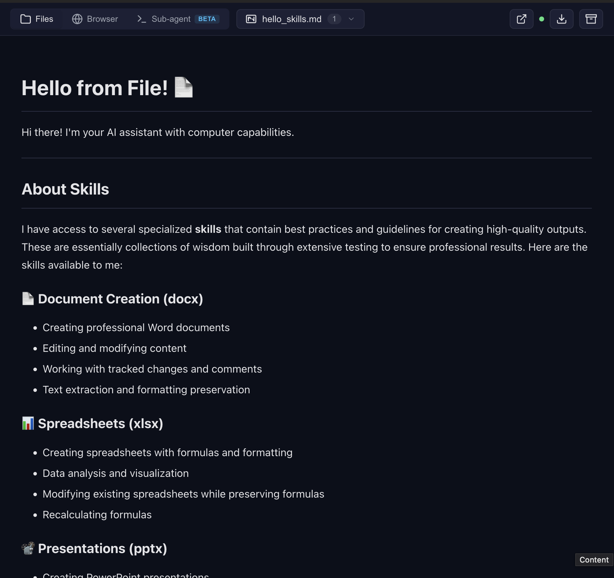

# Open WebUI Computer Use Filter

## Purpose

The Computer Use Filter (`openwebui/functions/computer_link_filter.py`) is the only integration point between Open WebUI and the Computer Use Server. Its `inlet()` fetches the server-baked system prompt over HTTP and injects it into the conversation when the `ai_computer_use` tool is active. Its `outlet()` decorates assistant messages that contain sandbox file URLs with a markdown preview link and an archive-download link. On patched Open WebUI builds (see Path B below) the preview link is auto-promoted to an inline artifact by the `fix_preview_url_detection` frontend patch; on stock builds it stays a one-click link — either way, the user reaches the preview SPA without a rebuild.

The filter is the single source of truth for the client-side URL shape; the server owns prompt content and preview rendering. Read the file itself for the authoritative Valve defaults and behaviour.

> **Heads up on prompt duplication.** The six-tier MCP-native surface (see `docs/system-prompt.md`) also writes the system prompt to `/home/assistant/README.md` and returns it on `InitializeResult.instructions`. In Open WebUI through LiteLLM, `InitializeResult.instructions` is **not** forwarded to the LLM (LiteLLM is a tool-call proxy and drops it), so the real duplication in this deployment is: filter `inlet()` injects the prompt once; the model optionally calls `view /home/assistant/README.md` if it follows the recovery-nudge in the `bash_tool` / `view` tool descriptions — that adds a second ~3–5K token copy. Worst case is two copies, not three. The nudge is kept to help pathological clients that strip the system prompt — alternatives discussed in `docs/system-prompt.md`.

## Installation

- Open WebUI → **Admin Panel** → **Functions** → **New Function**.
- Paste the entire contents of `openwebui/functions/computer_link_filter.py` into the editor.
- Save, then toggle the function on for the target model(s).
- Optionally override any Valve from the function's settings panel. Defaults are chosen so a fresh deployment works end-to-end as soon as the Computer Use Server is reachable at `http://localhost:8081`.
- Upstream reference: [Open WebUI Functions documentation](https://docs.openwebui.com/features/plugin/functions/).

## Preview panel isn't showing — two ways to fix it



When the AI generates a file, the preview panel shown above should open on the right. If nothing opens, here's why — and two ways to fix it.

### How the preview gets rendered

The filter's `outlet()` appends a markdown link `[🖥️ Open preview]({PUBLIC_BASE_URL}/preview/{chat_id})` to every assistant message that references a sandbox file. The URL comes from the server's `PUBLIC_BASE_URL` env var — delivered to the filter via the `X-Public-Base-URL` response header on `/system-prompt` and cached alongside the prompt, so the filter never needs its own copy of the public URL.

On *stock* Open WebUI the link stays a link: user clicks it, preview opens in a new tab. On *patched* Open WebUI (our `docker-compose.webui.yml` build) the `fix_preview_url_detection` patch sees `/preview/{chat_id}` in the message text and pushes a synthetic `<iframe>` artifact into the chat's `htmlGroups`. A second patch, `fix_artifacts_auto_show`, then auto-opens the side panel. No click required.

> **v4.1.0 note:** earlier versions also embedded a raw fenced ```html `<iframe>` block straight into the message. That turned out to be a foot-gun — the frontend patch's guard (`!htmlGroups.some(o=>o.html)`) skipped detection when the block was present, and stock Open WebUI rendered it as a visible code fence. v4.1.0 relies solely on the markdown link plus the patch.

### Path A — Stock Open WebUI (zero setup)

Do nothing — the filter already emits the markdown link. The user clicks `🖥️ Open preview` and the preview SPA opens in a new tab. Set `PREVIEW_MODE=off` in Valves if you don't want the link at all. See [Valves reference](#valves-reference).

### Path B — Apply our patches to Open WebUI (auto-opening side panel)

If you want the preview to pop open automatically inside the artifact panel like in the screenshot above, use our patched Open WebUI build:

- **Easiest:** use `docker-compose.webui.yml` from the repo root. It builds Open WebUI with `fix_artifacts_auto_show` and `fix_preview_url_detection` pre-applied.
- **Custom image:** if you maintain your own Open WebUI image, copy the two patch scripts (`openwebui/patches/fix_artifacts_auto_show.py` and `openwebui/patches/fix_preview_url_detection.py`) and run them against `/app/build/_app/immutable/chunks/*.js` at build time — see [`openwebui/Dockerfile`](../openwebui/Dockerfile) for the exact `RUN python3 /tmp/patches/...` invocations. Both patches are idempotent and tested against Open WebUI 0.11.0 (this build's strict target).

### Also check: `PUBLIC_BASE_URL` must be reachable from the user's browser

The iframe/button `src` comes from the server's `PUBLIC_BASE_URL` env var. It must be a hostname the user's browser can resolve — not Docker DNS. Set it in `.env` (`PUBLIC_BASE_URL=https://cu.example.com` for prod, `http://localhost:8081` for local dev). Connection-refused symptoms after that? See [Troubleshooting → connection refused](#preview-shows-connection-refused-or-a-blank-frame).

<a id="two-file_server_url-settings--they-must-match"></a>
### Two URL-roles — public (server env) and internal (filter+tool Valve)

**v4.0.0:** the "two `FILE_SERVER_URL`" problem is gone. There is now **one public URL**, owned by the server. The filter doesn't carry it any more — it's delivered in the `X-Public-Base-URL` response header on `/system-prompt` and cached alongside the prompt. Operator only has one knob for the public URL now.

| Role | Where | Default | Notes |
|------|-------|---------|-------|
| **Public URL** — baked into /system-prompt, returned to filter in header, model writes it in links | `computer-use-server` env `PUBLIC_BASE_URL` (set in `.env`) | `http://computer-use-server:8081` (internal Docker DNS — *the browser cannot resolve it*; override to a browser-reachable URL such as `http://localhost:8081` for local dev, `https://cu.example.com` in prod) | Single source of truth. The filter reads it from the response header; no filter Valve for it. `fix_preview_url_detection` is host-agnostic — the iframe src is reconstructed at runtime from the matched URL's own origin, so no build-arg is needed. |
| **Internal URL** — server→server fetch from inside the open-webui container | Filter Valve `ORCHESTRATOR_URL` and Tool Valve `ORCHESTRATOR_URL` (both seeded by `init.sh`) | `http://computer-use-server:8081` (Docker service DNS) | Only reachable inside the compose network. Browsers never see it. `init.sh` seeds both Valves from the `ORCHESTRATOR_URL` env on the open-webui container. |

**Custom project/network layouts.** The stock `docker-compose.yml` pins `container_name: computer-use-server`, so `docker compose -p myproject up` by itself does not rename the container — the internal hostname stays `computer-use-server`. If you remove/change that pin, set `ORCHESTRATOR_URL` on the open-webui container to the new hostname and `init.sh` will seed both Valves correctly.

For the full embedding checklist see [README.md → Required setup when embedding Open WebUI](../README.md#required-setup-when-embedding-open-webui-into-your-own-stack).

## Valves reference

| Name | Type | Default | Purpose |
|------|------|---------|---------|
| `ORCHESTRATOR_URL` | str | `"http://computer-use-server:8081"` | **Internal** URL of the Computer Use server. Used for server→server fetch of `/system-prompt` from inside the open-webui container. Never appears in browser-facing URLs — the public URL comes from the server's `PUBLIC_BASE_URL` env var via the `X-Public-Base-URL` response header. Trailing slash tolerated. Non-http(s) schemes are rejected. |
| `INJECT_SYSTEM_PROMPT` | bool | `True` | If `False`, `inlet()` skips system-prompt injection entirely — useful when another filter owns the prompt. |
| `PREVIEW_MODE` | Literal `"button" \| "off"` | `"button"` | Whether to emit the markdown preview link. `button` = emit `[🖥️ Open preview]({base}/preview/{chat_id})` (the `fix_preview_url_detection` frontend patch promotes it to an inline artifact on patched builds; stock Open WebUI leaves it as a plain clickable link). `off` = no preview link. |
| `ARCHIVE_BUTTON` | Literal `"on" \| "off"` | `"on"` | Append `[{ARCHIVE_BUTTON_TEXT}]({base}/files/{chat_id}/archive)` to assistant messages that contain files for the current chat. |
| `PREVIEW_BUTTON_TEXT` | str | `"🖥️ Open preview"` | Label for the preview-button markdown link (used when `PREVIEW_MODE` is `button`). |
| `ARCHIVE_BUTTON_TEXT` | str | `"📦 Download all files as archive"` | Label for the archive-download link (used when `ARCHIVE_BUTTON` is `on`). |

## Preview UX: which `PREVIEW_MODE` fits you?

- **`PREVIEW_MODE="button"`** (default). Every assistant message containing a sandbox file URL (or a `<details type="tool_calls">` block referencing a browser tool) is decorated with a markdown link `[🖥️ Open preview]({base}/preview/{chat_id})`. On stock Open WebUI the user clicks it to open the preview SPA in a new tab. On patched builds (`fix_preview_url_detection` + `fix_artifacts_auto_show`, shipped by `docker-compose.webui.yml`) the same URL is detected in text and auto-opened as an inline artifact — no click.
- **`PREVIEW_MODE="off"`**. No preview link. Combine with `ARCHIVE_BUTTON="off"` to make `outlet()` a no-op.

If you're upgrading from v4.0.0 / v3.x and saved `"artifact"` or `"both"` in your Valves, Pydantic validation will now reject the saved value — re-seed Valves after upgrade (`rm /app/backend/data/.computer-use-initialized` + restart).

## Archive button

`ARCHIVE_BUTTON="on"` (default) preserves the v3.0.x behaviour: when an assistant message contains at least one file URL under `{PUBLIC_BASE_URL}/files/{chat_id}/…`, `outlet()` appends a markdown link to the archive endpoint `/files/{chat_id}/archive`. The endpoint streams a zip of every file the sandbox has written for the chat. The append is idempotent (substring check against the fully-rendered URL) — safe to re-run `outlet()` on the same body as many times as the framework chooses.

## System prompt injection

`INJECT_SYSTEM_PROMPT` (default `True`) controls the `inlet()` path. When the `ai_computer_use` tool is active and `chat_id` is present, the filter HTTP-fetches the baked prompt from `{ORCHESTRATOR_URL}/system-prompt` and injects it into the system message, with a 5-minute LRU cache and a stale-cache fallback on transport failure. The response's `X-Public-Base-URL` header is cached alongside the prompt so `outlet()` can build correct browser-facing links without its own Valve. Non-http(s) schemes on `ORCHESTRATOR_URL` are rejected to avoid `file://` / `ftp://` information-disclosure paths. See `docs/system-prompt.md` for the server-side contract, including how `user_email` drives the `<available_skills>` block.

## Troubleshooting

### Preview shows "connection refused" or a blank frame

- Check that `PUBLIC_BASE_URL` (server `.env`) is reachable *from the user's browser* — the filter has no Valve for the public URL any more; everything flows from the server env.
- Confirm the Computer Use Server is running: `docker compose ps` should list the `computer-use-server` container as healthy.
- Copy the `src=` value out of the iframe and `curl` it directly — the SPA HTML should come back with HTTP 200.

### Preview link or archive button never appears

- The assistant message must contain at least one URL matching `{PUBLIC_BASE_URL}/files/{chat_id}/…` (or a `<details type="tool_calls">` block referencing a browser tool — covers pure-navigation sessions). No trigger, no decoration.
- `chat_id` must reach `outlet()` via `__metadata__`. Restart Open WebUI after toggling Valves if the model didn't re-init.
- `PREVIEW_MODE` must be `"button"` OR `ARCHIVE_BUTTON` must be `"on"`. When both are `"off"`, `outlet()` returns the body unchanged.

### Preview opens in a new tab instead of inside the artifact panel

You are running stock Open WebUI — the markdown link stays a link. Either live with the click (fine on mobile/minimal deploys) or apply Path B (`fix_preview_url_detection` + `fix_artifacts_auto_show`) to get the inline artifact panel.

### Filter cannot reach `computer-use-server` (cross-stack DNS)

**Symptom:** Preview iframe never auto-opens even on the patched build, system-prompt injection silently falls back to stale cache, or OWUI container logs show DNS errors / connection-refused on `http://computer-use-server:8081`. Manually editing the `ORCHESTRATOR_URL` Valve to a host IP (e.g. `http://192.168.x.x:8081`) makes the symptom disappear.

**Why:** `docker-compose.yml` and `docker-compose.webui.yml` reach each other through the **default Docker Compose network**, which only works when both stacks share a project name. Compose derives the project name from the parent directory (`open-computer-use`). If the two stacks end up with different project names — different parent directory, `-p custom-name` flag, `COMPOSE_PROJECT_NAME` env, `docker compose --project-directory`, or running them from separate clones — they get separate networks and `computer-use-server` no longer resolves from inside the OWUI container.

**Fixes (pick one):**

- **Restore the shared project name.** Keep both compose files in the same `open-computer-use/` directory and start them without `-p`. Verify with `docker network inspect open-computer-use_default` — both `computer-use-server` and `open-webui` should appear in the `Containers` section.
- **Override the env before bringing OWUI up:** add `ORCHESTRATOR_URL=http://host.docker.internal:8081` to `.env`. On Linux, also append `extra_hosts: ["host.docker.internal:host-gateway"]` to the `open-webui` service in `docker-compose.webui.yml` (Docker Desktop / macOS / Windows resolve this automatically). Then re-seed the Valves so the new env reaches the persistent OWUI database: `docker exec <owui> rm /app/backend/data/.computer-use-initialized && docker restart <owui>`.
- **Hard-set the Valve** via OWUI admin → Functions → Computer Use Filter → Valves → `ORCHESTRATOR_URL` to a host IP or hostname the OWUI container can reach. Quickest one-off fix, but it persists in the OWUI database and survives `.env` changes — easy to forget on the next deploy.

The same root cause also breaks the matching `ORCHESTRATOR_URL` Valve on the **Tool** (`computer_use_tools.py`) and the env var read by the `fix_large_tool_results` patch — fix once at the env layer and all three pick it up via `init.sh`.

### "Non-http scheme" error in logs

Caused by setting `ORCHESTRATOR_URL` to a `file://`, `ftp://`, or similarly non-http(s) URL. The filter rejects it and serves the stale cache if available, otherwise skips injection. Fix by pointing the Valve at an `http://` or `https://` endpoint.

## Version history

- **v4.1.0** — Breaking: removed `PREVIEW_MODE="artifact"` and `PREVIEW_MODE="both"`. `outlet()` no longer emits a fenced ```html `<iframe>` block; only the markdown preview link remains. The extra html block was redundant *and* actively harmful — the `fix_preview_url_detection` frontend patch guards on `!htmlGroups.some(o=>o.html)`, so when outlet pre-emitted an html block the patch skipped detection and the iframe rendered as a raw code fence in chat (issue #43 symptom). `"button"` is the new default; matches internal prod v3.8.0 behaviour. Saved `"artifact"` / `"both"` values fail Pydantic validation — re-seed Valves after upgrade.
- **v4.0.0** — Breaking: removed `FILE_SERVER_URL` and `SYSTEM_PROMPT_URL` Valves, replaced with a single `ORCHESTRATOR_URL` Valve (internal URL). The public URL is now owned by the server (`PUBLIC_BASE_URL` env) and delivered to the filter via the `X-Public-Base-URL` response header on `/system-prompt`. `_fetch_system_prompt()` now returns `(public_url, prompt)`; `outlet()` reads `public_url` from the cache instead of its own Valve. Tool's `FILE_SERVER_URL` Valve was renamed to `ORCHESTRATOR_URL` for consistency. `init.sh` re-seeds the new Valve names.
- **v3.4.0** — Removed the three legacy v3.2.0 boolean Valves (`ENABLE_PREVIEW_ARTIFACT`, `ENABLE_PREVIEW_BUTTON`, `ENABLE_ARCHIVE_BUTTON`) and their migration bridge. `PREVIEW_MODE` and `ARCHIVE_BUTTON` are the only knobs. Users upgrading straight from v3.2.0 revert to defaults — upgrade via v3.3.0 first if you need to preserve saved preferences.
- **v3.3.0** — Collapsed three boolean preview/archive Valves (`ENABLE_PREVIEW_ARTIFACT`, `ENABLE_PREVIEW_BUTTON`, `ENABLE_ARCHIVE_BUTTON`) into two Literal Valves (`PREVIEW_MODE`, `ARCHIVE_BUTTON`). Existing v3.2.0 deployments were migrated transparently by a Pydantic `@model_validator(mode="after")`. `outlet()` behaviour and all v3.1.0/v3.2.0 invariants preserved.
- **v3.2.0** — Added `ENABLE_PREVIEW_ARTIFACT` (default `True`), `ENABLE_PREVIEW_BUTTON` (default `False`), and `PREVIEW_BUTTON_TEXT` Valves. `outlet()` now emits an inline iframe artifact and/or a markdown preview link alongside the archive button. All v3.1.0 invariants preserved.
- **v3.1.0** — Removed the hardcoded ~460-line system prompt f-string; server became the single source of truth. HTTP fetch + LRU cache + stale-cache fallback. `SYSTEM_PROMPT_URL` Valve added (removed in v4.0.0); non-http(s) schemes rejected.
- **v3.0.2** — Last hardcoded-prompt revision. See git history for details.

For deeper context, consult the CHANGELOG blocks in the module docstring of `openwebui/functions/computer_link_filter.py` and the per-commit history on `main`.
